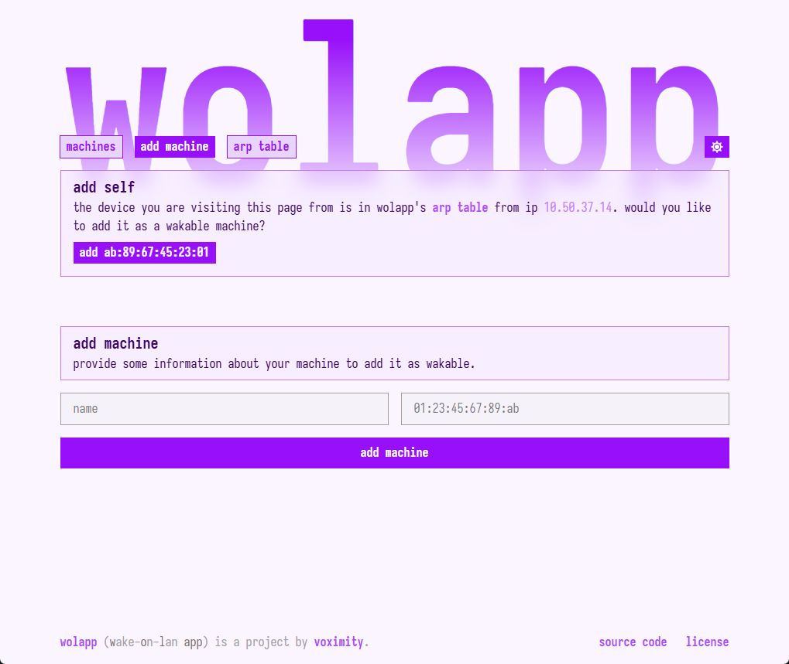

# wolapp



**wolapp** is a small server and web UI to send [Wake-on-LAN packets](https://en.wikipedia.org/wiki/Wake-on-LAN) at devices on your network.

Some notable features:

* Add any number of **wakable machines** by their MAC address, and wake them from the tap of a button
* Quickly add the machine **visiting the web UI**, saving you from looking up your MAC address
* View your host machine's **ARP table** and add entries from there
* *(soon)* **Password protect** machines from being awoken
* *(eventually)* String together **separate wolapp instances** to wake machines from one unified page

## Running in Docker (recommended)

**This strategy will only work on Linux**, as Docker for Windows does not support `network_mode: host`.

1. Clone the repository
2. Create `wol.db` at the base of the repository as an empty file
3. Run `docker compose up -d`, which will build the image automatically

Access `wolapp` from port `8080` by default. Otherwise, modify the `APP_PORT` environment variable
in `compose.yaml`.

## Running on Windows, or outside of Docker

Optionally pass `APP_PORT=1234` to change the port wolapp listens on.

```sh
cd frontend
npm i
npm run build
cd ..
cargo run --release
```

To develop, run the following two separately:

```sh
# in one terminal
cd frontend && npm run dev
# in another
cargo run
```
